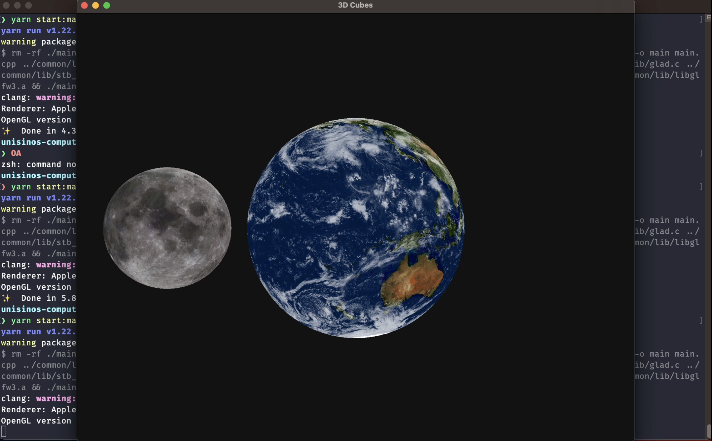

# Universe

Neste projeto são carregados dois OBJs, um representando a Lua e outro a Terra. A terra fica estática apenas rodando em seu eixo Y e a Lua, além de rotar em seu próprio eixo Y segue uma curva paramétrica predefinida em um arquivo de configuração.

## OBJS

Os `objs` são lidos pela função `parseOBJFile` que esta declarada no arquivo `obj-utils.hpp`. Além de ler o arquivo e fazer o parse de todos as informações referentes ao objeto, essa função também é responsável por triangularizar o objeto, ou seja, transformar todas as faces em triângulos.

## Fonte de Luz

É declarada apenas uma fonte de luz branca que fica fixa na posição `15.0f, 15.0f, 2.0f`. Essa fonte de luz é utilizada para iluminar os dois objetos de forma difusa e especular utilizando o modelo de iluminação de Phong.

## Curva Paramétrica

A curva paramétrica é definida no arquivo `animations/config.txt` e é lida pela função `generateControlPointsSet` que esta declarada no arquivo `animations-utils.hpp`. A curva é definida por um conjunto de pontos e cada ponto é definido por um vetor de 3 posições. Esta curva é utilizada para que se possa animar a Lua ao redor da Terra.

## Controle de camera

A camera é controlada utilizando o mouse e o teclado. Para controlar a posição da camera é utilizado o teclado e para controlar a direção da camera é utilizado o mouse.

W - Move a camera para frente
A - Move a camera para esquerda
S - Move a camera para trás
D - Move a camera para direita
Mouse - Controla a direção da camera